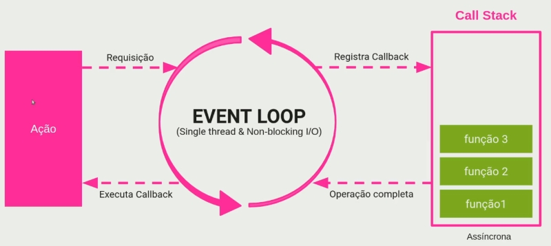

# Conhecendo o Node.js

- Abertura - 00:17
- O que é uma API - 04:30: Nessa aula entenderemos o funcionamento de uma API com uma analogia a um restaurante. Em seguida entenderemos os termos técnicos como \*request, response, client e server.
- O que é o Node.js - 01:15: Nessa aula entenderemos o que é o Node.js, como ele funciona e onde podemos utilizá-lo.
- Onde o Node.js pode ser utilizado - 01:22: Nessa aula veremos diversas formas de utilizar o Node.js como em sites, apps, scripts, micro-serviços entre outros.
  

- Vantagens do Node.js - 03:11: Nessa aula veremos as vantagens de utilização do Node.js, além do seu ecossistema gigante (comunidade, bibliotecas), as maiores empresas que utilizam o Node.js.[OpenJS](https://openjsf.org/), [kinsta.com](https://kinsta.com/pt/blog/), [node-js-aplicacoes](https://kinsta.com/pt/blog/node-js-aplicacoes/)
  

- v8 Engine - 01:15: Nessa aula aprenderemos o que é a v8 Engine por baixo dos panos no Node.js.
  - V8 é o interpretador JavaScript, também chamado de máquina virtual Javascript (ou engine), desenvolvido pela Google e utilizado em seu navegador Google Chrome. V8 é uma ferramenta desenvolvida na linguagem C++ e distribuída no regime de código aberto.
- O funcionamento do Node - 05:52: Nessa aula entenderemos o funcionamento do Node.js de forma mais detalhada (Event-loop, single-thread, Non-blocking I/O)
    * `Event-loop`: O JavaScript possui um modelo de concorrência baseado em um event loop (laço de eventos), em português), responsável pela execução do código, coleta e processamento de eventos e execução de subtarefas enfileiradas. Este modelo é bem diferente de outras linguagens, como C ou Java, por exemplo.
    * `Single-thread`: só pode tratar uma requisição de cada vez, então o processamento de cada uma não pode ser demorado, nem pode bloquear (por exemplo, ficar esperando pelo banco de dados).
    * `Non-blocking I/O`: É a capacidade de fazer operações de entrada e saída (acessar sistema de arquivos, banco de dados, rede, servidores, etc.) sem que a aplicação fique impedida de executar outras coisas em paralelo.

  

- Iniciando um projeto Nodejs - 04:49
    1. Criar uma pasta
    2. digitar `npm init -y` (cria o arquivo `package.json`)
